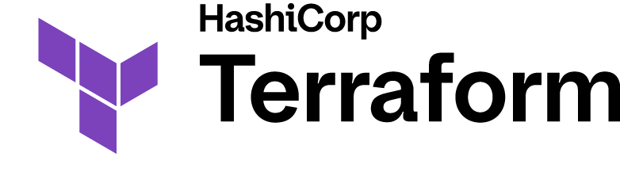
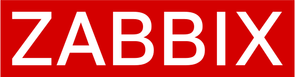

# Terraform Provider Zabbix

[](https://github.com/gringolito/terraform-provider-zabbix/actions/workflows/ci.yaml)
[](https://codecov.io/gh/gringolito/terraform-provider-zabbix)
[](https://github.com/gringolito/terraform-provider-zabbix/releases)
[](LICENSE)

<p>
  <a href="https://www.terraform.io"></a>
  &nbsp;&nbsp;&nbsp;&nbsp;&nbsp;&nbsp;
  
</p>

A Terraform provider for managing [Zabbix](https://www.zabbix.com) resources: hosts, templates,
triggers, media types, users, and more — via the Zabbix JSON-RPC API.

## Requirements

| Requirement | Version |
|-------------|---------|
| [Terraform](https://developer.hashicorp.com/terraform/downloads) | >= 1.13 |
| [Zabbix](https://www.zabbix.com/download) | 7.0 LTS (fully supported); 7.2, 7.4 (best-effort) |

## Quick Start

Add the provider to your Terraform configuration:

```hcl
terraform {
  required_providers {
    zabbix = {
      source  = "gringolito/zabbix"
      version = "~> 1.0"
    }
  }
}

provider "zabbix" {
  zabbix_url = "https://zabbix.example.com"
  api_token  = "your-api-token"
}

resource "zabbix_host_group" "example" {
  name = "My Host Group"
}
```

Provider credentials can also be supplied via environment variables:

```shell
export ZABBIX_URL="https://zabbix.example.com"
export ZABBIX_TOKEN="your-api-token"
```

---

## Documentation

Full documentation will be available on the
[Terraform Registry](https://registry.terraform.io/providers/gringolito/zabbix/latest/docs)
once published.

---

## Roadmap

This project uses [Milestones](https://github.com/gringolito/terraform-provider-zabbix/milestones)
to scope upcoming features and bug fixes, prioritized in the
[Project backlog](https://github.com/users/gringolito/projects/4). Items that receive the most
reactions or recent discussion are more likely to be included in an upcoming release.

---

## Contributing

See [CONTRIBUTING.md](CONTRIBUTING.md) for development setup, coding conventions, and the pull
request process.

---

## License

This project is licensed under the [Mozilla Public License 2.0](LICENSE).

---

## On Beer-ware and the spirit that lives on

There is a beautiful license called the Beerware License. It was written by Poul-Henning Kamp
sometime in the 1990s and it says, more or less: *if you think this software is worth it, and we
ever meet in person, you can buy me a beer.*

It is one of the most honest licenses ever written. It captures exactly the spirit of open source:
share freely, ask for nothing, and if someone's work genuinely helped you, buy them a drink and
tell them about it.

Sadly, the Beerware License is not OSI-approved. It lacks the formal language needed for corporate
legal teams to wave it through, which means, in a cruel twist, the most human license ever written
is the one least likely to be used by humans working inside institutions.

So this project is MPL-2.0. Lawyers can sleep soundly.

But the spirit is still here. If this provider saved you an afternoon of clicking through the
Zabbix UI, helped you bring your monitoring infrastructure under version control, or simply made
your on-call life a little less painful, and if we ever happen to meet in person, you can buy me
a beer.

---

*Zabbix is a registered trademark of Zabbix LLC.*

*Terraform and the Terraform logo are trademarks of HashiCorp.*
